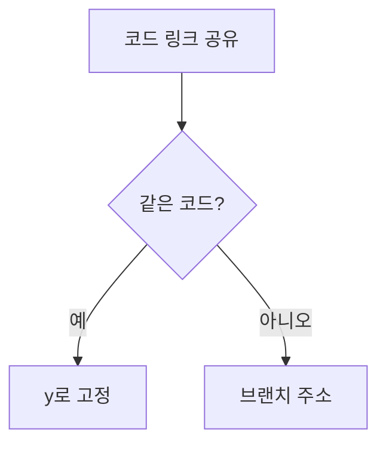
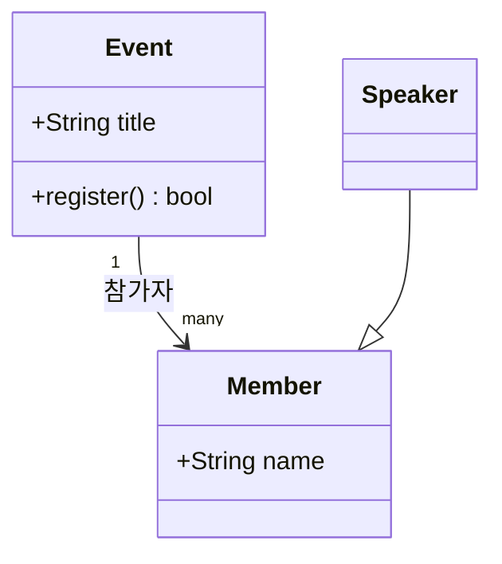
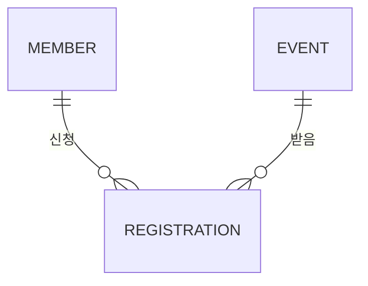
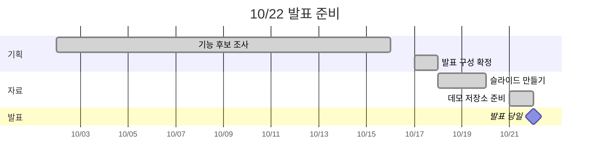

# Mermaid 다이어그램

코드 블록의 언어를 `mermaid`로 쓰면 그림이 됩니다.

## 1. 링크를 공유할 때 y를 눌러야 할까?

```mermaid
flowchart TD
  A[코드 링크 공유] --> B{같은 코드?}
  B -->|예| C[y로 고정]
  B -->|아니오| D[브랜치 주소]
```

## 2. 클래스 다이어그램

```mermaid
classDiagram
    class Event {
        +String title
        +register() bool
    }
    class Member {
        +String name
    }
    class Speaker
    Event "1" --> "many" Member : 참가자
    Speaker --|> Member
```

## 3. ER 다이어그램

```mermaid
erDiagram
    MEMBER ||--o{ REGISTRATION : "신청"
    EVENT ||--o{ REGISTRATION : "받음"
```

## 4. 간트 차트: 발표 준비 일정

```mermaid
gantt
    title 10/22 발표 준비
    dateFormat YYYY-MM-DD
    axisFormat %m/%d

    section 기획
    기능 후보 조사      :done, a1, 2026-10-02, 2026-10-16
    발표 구성 확정      :done, a2, 2026-10-17, 1d

    section 자료
    슬라이드 만들기     :done, a3, 2026-10-18, 2d
    데모 저장소 준비    :done, a4, 2026-10-21, 1d

    section 발표
    발표 당일           :milestone, m1, 2026-10-22, 0d
```
